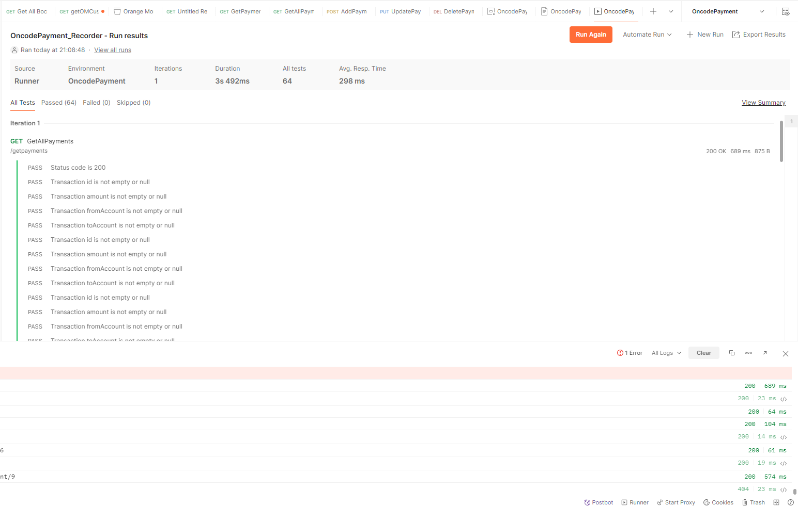
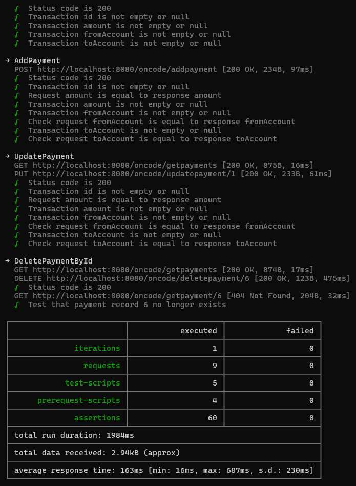

# Using Postman pre-request scripts and tests to test the APIs

**Collection** - OncodePayment_Recorder.postman_collection.json

**Environment** - OncodePayment.postman_environment.json

Run the collection with Newman on the command line:

`newman run OncodePayment_Recorder.postman_collection.json -e OncodePayment.postman_environment.json`

