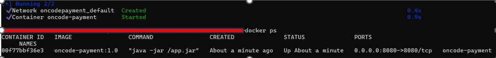

# OncodePayment

OnCode payment recorder mimics a payment record solution. It is a REST API Project written in Java with the Spring framework with H2 in-memory database.

The technologies for development, deployment and CI/CD include:

### Docker
Dockerfile is available in project and image has been built with:

`docker build -t oncode-payment:1.0 .`

Docker compose file has been created and can be run with:

`docker-compose -f compose.yaml up -d`

Docker container for oncode-paymentv1 running on machine.

### Postman
4 end points have been developed.
1. **GetAllPayments** - {{payurl}}/getpayments
   - HTTP Method - GET
2. **GetPaymentById** - {{payurl}}/getpayment/{{paymentId}}
   - HTTP Method - GET
3. **AddPayment** - {{payurl}}/addpayment
   - HTTP Method - POST
4. **UpdatePayment** - {{payurl}}/updatepayment/{{paymentId}}
   - HTTP Method - PUT
5. **DeletePaymentById** - {{payurl}}/deletepayment/{{paymentId}}
   - HTTP Method - DELETE

A postman collection [Postman Artifacts](/PostmanArtifacts) containing pre-request scripts and tests has been created to automate tests for the above endpoints.
This can be imported along with the environment for testing.

### Jenkins

Jenkins image has been downloaded and started as a container in Docker with the following commands in Dockerfile. 

_FROM jenkins/jenkins:lts

USER root

RUN apt-get update && \
apt-get install -y apt-transport-https \
ca-certificates \
curl \
gnupg \
lsb-release && \
curl -fsSL https://download.docker.com/linux/debian/gpg | gpg --dearmor -o /usr/share/keyrings/docker-archive-keyring.gpg && \
echo "deb [arch=amd64 signed-by=/usr/share/keyrings/docker-archive-keyring.gpg] https://download.docker.com/linux/debian $(lsb_release -cs) stable" | tee /etc/apt/sources.list.d/docker.list > /dev/null && \
apt-get update && \
apt-get install -y docker-ce-cli`

USER jenkins_

This command will build the image

`docker build -t jenkins-with-docker-cli-installed:latest .`

This will start the jenkins image in a container and apply a socket mounting between the host(Docker) and the docker inside the jenkins container.
`docker run -p 8080:8080 -p 50000:50000 -d \
-v jenkins_home:/var/jenkins_home \
-v /var/run/docker.sock:/var/run/docker.sock \
jenkins-with-docker-cli-installed:latest`

Below showing the deployment of the app in the jenkins home.

A Jenkins folder has been created [Jenkins_Artifacts](/Jenkins) containing details of the Jenkins file.
### Kubernetes
