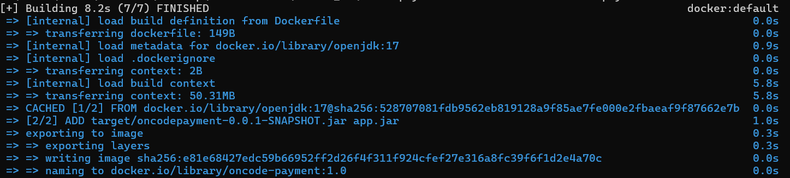
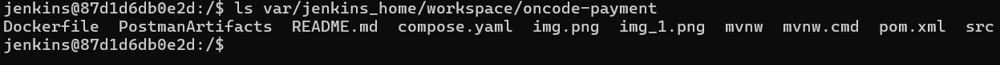

# OncodePayment

OnCode payment recorder mimics a payment transfer solution. It is a REST API Project written in Java with the Spring framework with H2 in-memory database.

The technologies for development, testing and CI/CD include:

### REST Assured
### Postman
4 end points have been developed.
1. **GetAllPayments** - {{payurl}}/getpayments
   - HTTP Method - GET
2. **GetPaymentById** - {{payurl}}/getpayment/{{paymentId}}
   - HTTP Method - GET
3. **AddPayment** - {{payurl}}/addpayment
   - HTTP Method - POST
4. **UpdatePayment** - {{payurl}}/updatepayment/{{paymentId}}
   - HTTP Method - PUT
5. **DeletePaymentById** - {{payurl}}/deletepayment/{{paymentId}}
   - HTTP Method - DELETE

A postman collection containing pre-request scripts and tests has been created to automate tests for the above endpoints.
This can be imported along with the environment for testing.

**Collection** - OncodePayment_Recorder.postman_collection.json

**Environment** - OncodePayment.postman_environment.json

### Jenkins
<<<<<<< Updated upstream
### Docker
=======

### REST Assured
>>>>>>> Stashed changes
### Kubernetes
