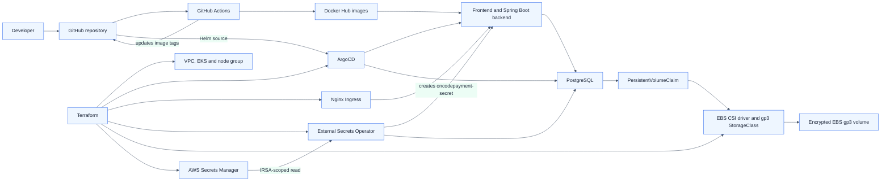

# OnCode Payment

OnCode Payment is an end-to-end GitOps platform for a Spring Boot payment application. It combines multi-stage Docker builds, a Helm chart, Terraform-provisioned AWS EKS infrastructure, GitHub Actions image delivery, ArgoCD reconciliation, AWS Secrets Manager through ESO and IRSA, and EBS-backed PostgreSQL storage.

## Architecture


```mermaid
%%{init: {"theme": "base", "themeVariables": {
  "background": "#ffffff",
  "primaryColor": "#eef6ff",
  "primaryTextColor": "#172033",
  "primaryBorderColor": "#2563eb",
  "lineColor": "#475569",
  "secondaryColor": "#ecfdf5",
  "tertiaryColor": "#fff7ed",
  "clusterBkg": "#f8fafc",
  "clusterBorder": "#94a3b8"
}}}%%
flowchart LR
    Dev["Developer"] --> Git["GitHub repository"]
    Git --> CI["GitHub Actions"]
    CI --> Images["Docker Hub images"]
    CI -->|"updates image tags"| Git

    TF["Terraform"] --> AWS["VPC, EKS and node group"]
    TF --> Argo["ArgoCD"]
    TF --> Ingress["Nginx Ingress"]
    TF --> ESO["External Secrets Operator"]
    TF --> Storage["EBS CSI driver and gp3 StorageClass"]
    TF --> Secret["AWS Secrets Manager"]

    Git -->|"Helm source"| Argo
    Argo --> App["Frontend and Spring Boot backend"]
    Argo --> DB["PostgreSQL"]
    Images --> App

    Secret -->|"IRSA-scoped read"| ESO
    ESO -->|"creates oncodepayment-secret"| App
    ESO --> DB

    DB --> PVC["PersistentVolumeClaim"]
    PVC --> Storage
    Storage --> EBS["Encrypted EBS gp3 volume"]

    Ingress --> App
    App --> DB
```

### Secret And Storage Flow

1. AWS Secrets Manager stores one JSON secret named `oncodepayment-dev/postgres`.
2. The secret contains `DB_USERNAME` and `DB_PASSWORD`.
3. The ESO service account assumes a dedicated IAM role through the EKS OIDC provider.
4. The role permits read access only to the PostgreSQL secret.
5. `ExternalSecret` creates `oncodepayment-secret` in the application namespace.
6. The backend and PostgreSQL pods read the two keys through `secretKeyRef`.

No database password is stored in tracked Helm values or Kubernetes manifests.

The PostgreSQL PVC requests the `ebs-gp3` StorageClass on EKS. The EBS CSI controller creates an encrypted gp3 volume in the selected node's Availability Zone, Kubernetes binds it as a PV, and the volume mounts at `/var/lib/postgresql/data`.

The chart retains `standard` as its Kind default. EKS overrides it through `values-eks.yaml`. The complete AWS secret flow requires EKS, OIDC, and IRSA.

## Stack

| Area | Technology |
| --- | --- |
| Backend | Java 17, Spring Boot, Spring Data JPA |
| Frontend | HTML, CSS, JavaScript, Nginx |
| Database | PostgreSQL 16 |
| Local runtime | Docker Compose |
| Kubernetes | Amazon EKS, with Kind-compatible chart defaults |
| Infrastructure | Terraform |
| Delivery | Helm, ArgoCD, GitHub Actions |
| Secrets | AWS Secrets Manager, ESO, IRSA |
| Storage | Amazon EBS CSI, encrypted gp3 |

## Local Development

Requirements: Docker and Docker Compose.

```bash
cp .env.example .env
```

Set a local password in `.env`. This file is ignored by Git.

```bash
docker compose up --build
```

- Frontend: `http://localhost`
- Backend API: `http://localhost:8098/oncode/getpayments`

Stop the stack:

```bash
docker compose down
```

Delete the local PostgreSQL volume:

```bash
docker compose down -v
```

## Deploy to EKS

### Requirements

- AWS CLI with an authenticated profile
- Terraform 1.14 or later
- kubectl
- Helm 3
- jq
- An AWS account with permission to create VPC, EKS, IAM, EC2, EBS, and Secrets Manager resources

EKS, NAT Gateway, EC2, EBS, and Secrets Manager incur charges. Create the environment for a focused session and destroy it the same day.

### 1. Configure AWS access

```bash
aws sso login --profile mega
export AWS_PROFILE=mega
export AWS_REGION=us-east-2
```

Create an ignored `terraform/terraform.tfvars` from the example. Set the IAM role ARNs that need cluster access:

```bash
cp terraform/terraform.tfvars.example terraform/terraform.tfvars
```

Use an IAM role ARN for AWS SSO, not the temporary STS assumed-role ARN.

### 2. Provision AWS infrastructure

```bash
terraform -chdir=terraform init
terraform -chdir=terraform validate

terraform -chdir=terraform apply \
  -target=module.vpc \
  -target=module.eks \
  -target=aws_secretsmanager_secret.postgres_credentials \
  -target=aws_iam_policy.external_secrets_read_postgres \
  -target=aws_iam_role.external_secrets \
  -target=aws_iam_role_policy_attachment.external_secrets_read_postgres \
  -target=aws_iam_role.ebs_csi \
  -target=aws_iam_role_policy_attachment.ebs_csi \
  -target=aws_eks_addon.ebs_csi
```

Refresh kubeconfig after EKS is ready:

```bash
aws eks update-kubeconfig \
  --region us-east-2 \
  --name oncodepayment-dev \
  --profile mega

kubectl wait --for=condition=Ready nodes --all --timeout=15m
```

### 3. Store the database credentials

Enter the values without writing them into the repository or shell history:

```bash
read -rp "Database username: " DB_USERNAME
read -rsp "Database password: " DB_PASSWORD
echo

SECRET_JSON="$(
  jq -n \
    --arg username "$DB_USERNAME" \
    --arg password "$DB_PASSWORD" \
    '{DB_USERNAME: $username, DB_PASSWORD: $password}'
)"

aws secretsmanager put-secret-value \
  --region us-east-2 \
  --secret-id oncodepayment-dev/postgres \
  --secret-string "$SECRET_JSON"

unset DB_USERNAME DB_PASSWORD SECRET_JSON
```

### 4. Install storage and platform components

```bash
terraform -chdir=terraform apply \
  -target=kubernetes_storage_class_v1.ebs_gp3

terraform -chdir=terraform apply \
  -target=kubernetes_namespace.external_secrets \
  -target=helm_release.external_secrets \
  -target=kubectl_manifest.cluster_secret_store

terraform -chdir=terraform apply \
  -target=kubernetes_namespace.app \
  -target=kubernetes_namespace.argocd \
  -target=kubernetes_namespace.ingress_nginx \
  -target=helm_release.nginx_ingress \
  -target=helm_release.argocd \
  -target=kubectl_manifest.argocd_app
```

ArgoCD reads the Helm chart from `master`, not from the local working tree. Commit and push chart changes before expecting a sync.

### 5. Verify

```bash
kubectl get nodes
kubectl get csidriver ebs.csi.aws.com
kubectl get storageclass ebs-gp3
kubectl get clustersecretstore aws-secrets-manager
kubectl -n oncodepayment get externalsecret,secret,pvc,pods
kubectl -n argocd get application oncodepayment
terraform -chdir=terraform plan
```

Expected state:

- `ClusterSecretStore`: `Valid`
- `ExternalSecret`: `SecretSynced`
- PostgreSQL PVC: `Bound` on `ebs-gp3`
- Application pods: `Running`
- ArgoCD Application: `Synced` and `Healthy`

Access the frontend:

```bash
kubectl -n oncodepayment port-forward \
  service/oncodepayment-frontend-service 8080:80
```

Open `http://localhost:8080`.

### ArgoCD UI

```bash
kubectl -n argocd port-forward service/argocd-server 8081:443
```

Open `https://localhost:8081` and sign in as `admin`.

```bash
kubectl -n argocd get secret argocd-initial-admin-secret \
  -o jsonpath='{.data.password}' | base64 -d
echo
```

## Teardown

Destroy in reverse order so Kubernetes removes the application resources and EBS-backed PVC before EKS access and the CSI driver disappear:

```bash
terraform -chdir=terraform destroy \
  -target=kubectl_manifest.argocd_app

terraform -chdir=terraform destroy \
  -target=kubectl_manifest.cluster_secret_store \
  -target=helm_release.argocd \
  -target=helm_release.nginx_ingress \
  -target=helm_release.external_secrets \
  -target=kubernetes_namespace.app \
  -target=kubernetes_namespace.argocd \
  -target=kubernetes_namespace.ingress_nginx \
  -target=kubernetes_namespace.external_secrets

terraform -chdir=terraform destroy
```

The Secrets Manager resource uses `recovery_window_in_days = 0`. Teardown permanently deletes the secret and permits reuse of the same name.

## CI/CD

Pushes to `master` run Maven tests, build backend and frontend images, and push them to Docker Hub. GitHub Actions then updates the Helm image tags and commits the change. ArgoCD detects that commit and rolls out the new images.

Required GitHub Actions secrets:

- `DOCKERHUB_USERNAME`
- `DOCKERHUB_TOKEN`

Run tests locally:

```bash
./mvnw clean test
```

## API

Base path: `/oncode`

| Method | Path | Action |
| --- | --- | --- |
| GET | `/getpayments` | List payments |
| GET | `/getpayment/{id}` | Get a payment |
| POST | `/addpayment` | Create a payment |
| PUT | `/updatepayment/{id}` | Update a payment |
| DELETE | `/deletepayment/{id}` | Delete a payment |

```json
{
  "amount": 42.42,
  "fromAccount": 1111111,
  "toAccount": 2222222
}
```

## Security

- Database credentials stay outside Git.
- ESO receives least-privilege access to one Secrets Manager secret.
- IRSA trust policies bind IAM roles to exact Kubernetes service accounts.
- EKS access entries grant admin or viewer policies through configured IAM role ARNs.
- PostgreSQL storage uses encrypted EBS volumes.
- Terraform state contains infrastructure metadata and must remain protected and uncommitted.

Run this before committing:

```bash
git grep -n -i -E 'password[[:space:]]*[:=][[:space:]]*[^$<{]' \
  -- ':!README.md' ':!.env.example'
```
