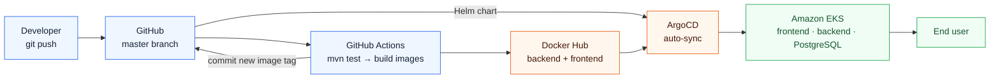

# OnCode Payment

> An end-to-end GitOps reference platform: a Spring Boot payment API shipped from commit to Amazon EKS through GitHub Actions, Docker, Helm, ArgoCD, and Terraform.


OnCode Payment is an end-to-end GitOps platform that takes a Spring Boot payment API from commit to Amazon EKS. It brings together the engineering expected of a production delivery pipeline: multi-stage Docker builds, a Helm chart, Terraform-provisioned AWS (VPC, EKS, IAM/IRSA, EBS), GitHub Actions image delivery, ArgoCD reconciliation, and secrets sourced from AWS Secrets Manager through the External Secrets Operator.

## Contents

- [Pipeline](#pipeline)
- [What it demonstrates](#what-it-demonstrates)
- [Tech stack](#tech-stack)
- [Repository layout](#repository-layout)
- [Quick start (local)](#quick-start-local)
- [Deploy to Amazon EKS](#deploy-to-amazon-eks)
- [How secrets and storage flow](#how-secrets-and-storage-flow)
- [CI/CD](#cicd)
- [API reference](#api-reference)
- [Security](#security)
- [Teardown](#teardown)

## Pipeline

The delivery path is a single straight line from a commit to a running workload. Terraform provisions the cluster once; everything below runs on every push.


```mermaid
flowchart LR
    Dev["Developer<br/>git push"] --> GH["GitHub<br/>master branch"]
    GH --> CI["GitHub Actions<br/>mvn test → build images"]
    CI --> Hub["Docker Hub<br/>backend + frontend"]
    CI -->|"commit new image tag"| GH
    GH -->|"Helm chart"| Argo["ArgoCD<br/>auto-sync"]
    Hub --> Argo
    Argo --> EKS["Amazon EKS<br/>frontend · backend · PostgreSQL"]
    EKS --> User["End user"]

    classDef build fill:#eef6ff,stroke:#2563eb,color:#172033
    classDef deliver fill:#fff7ed,stroke:#ea580c,color:#431407
    classDef run fill:#f0fdf4,stroke:#16a34a,color:#14532d
    class Dev,GH,CI build
    class Hub,Argo deliver
    class EKS,User run
```

1. A push to `master` triggers GitHub Actions, which runs the Maven tests.
2. On success, it builds the backend and frontend images and pushes them to Docker Hub, tagged with the commit SHA.
3. The same workflow rewrites the image tags in the Helm chart and commits the change back to `master`.
4. ArgoCD watches the chart in Git, detects the new tags, and syncs them to the cluster.
5. EKS rolls out the updated pods; the frontend, backend, and PostgreSQL serve the application.

## What it demonstrates

- **GitOps delivery** — Git is the single source of truth; ArgoCD reconciles the cluster to match it, with automated prune and self-heal.
- **Immutable, traceable images** — every deploy is pinned to a commit SHA, so a running pod maps back to an exact commit.
- **Infrastructure as Code** — the entire AWS footprint (VPC, EKS, IAM, IRSA, EBS CSI) is declared in Terraform and reproducible from zero.
- **Secretless manifests** — no database credential ever lives in Git; the External Secrets Operator pulls it from AWS Secrets Manager using an IRSA-scoped, least-privilege IAM role.
- **Encrypted, durable storage** — PostgreSQL runs as a StatefulSet backed by an encrypted EBS gp3 volume provisioned on demand by the EBS CSI driver.

## Tech stack

| Area | Technology |
| --- | --- |
| Backend | Java 17, Spring Boot 3.2, Spring Data JPA |
| Frontend | HTML, CSS, vanilla JavaScript, Nginx |
| Database | PostgreSQL 16 |
| Local runtime | Docker Compose |
| Container build | Multi-stage Docker |
| Kubernetes | Amazon EKS 1.34 (Kind-compatible chart defaults) |
| Infrastructure | Terraform (terraform-aws-modules for VPC and EKS) |
| Delivery | Helm, ArgoCD, GitHub Actions, Docker Hub |
| Secrets | AWS Secrets Manager, External Secrets Operator, IRSA |
| Storage | Amazon EBS CSI driver, encrypted gp3 |

## Repository layout

```
.
├── src/                      Spring Boot payment API (controller, entity, repository)
├── frontend/                 Static UI served by Nginx, proxied to the backend
├── Dockerfile                Multi-stage backend image
├── docker-compose.yml        Local stack: backend + frontend + PostgreSQL
├── helm/oncodepayment/       Helm chart (StatefulSet, deployments, services, ingress, ESO)
│   ├── values.yaml           Defaults; image tags updated by CI
│   └── values-eks.yaml       EKS overrides (ebs-gp3 storage class)
├── terraform/                AWS: VPC, EKS, IRSA, Secrets Manager, EBS CSI, ArgoCD
├── scripts/                  Guided apply/destroy helpers for the EKS flow
└── .github/workflows/        CI/CD pipeline
```

## Quick start (local)

Requirements: Docker and Docker Compose. No JDK or Maven needed — the image builds inside Docker.

```bash
cp .env.example .env          # then set a local database password in .env
docker compose up --build
```

- Frontend: <http://localhost>
- Backend API: <http://localhost:8098/oncode/getpayments>

```bash
docker compose down           # stop
docker compose down -v        # stop and delete the PostgreSQL volume
```

Run the tests on their own:

```bash
./mvnw clean test
```

## Deploy to Amazon EKS

> EKS, NAT Gateway, EC2, EBS, and Secrets Manager all incur charges while they run. Take care to tear everything down once you have finished testing (see [Teardown](#teardown)).

### Requirements

- AWS CLI with an authenticated profile
- Terraform 1.14+ · kubectl · Helm 3 · jq
- An AWS account allowed to create VPC, EKS, IAM, EC2, EBS, and Secrets Manager resources

### 1. Configure AWS access

```bash
aws sso login --profile my-sso-profile
export AWS_PROFILE=my-sso-profile
export AWS_REGION=us-east-2

cp terraform/terraform.tfvars.example terraform/terraform.tfvars
```

Set the IAM role ARNs that need cluster access in `terraform.tfvars`. For AWS SSO, supply the permanent permission-set role ARN (the `arn:aws:iam::<account>:role/aws-reserved/sso.amazonaws.com/.../AWSReservedSSO_...` value), not the temporary STS assumed-role session ARN that `aws sts get-caller-identity` returns. EKS access entries match the underlying role, so the temporary session ARN will not grant access.

### 2. Provision AWS infrastructure (VPC, EKS, IRSA, EBS CSI)

```bash
terraform -chdir=terraform init
terraform -chdir=terraform validate

terraform -chdir=terraform apply \
  -target=module.vpc \
  -target=module.eks \
  -target=aws_secretsmanager_secret.postgres_credentials \
  -target=aws_iam_policy.external_secrets_read_postgres \
  -target=aws_iam_role.external_secrets \
  -target=aws_iam_role_policy_attachment.external_secrets_read_postgres \
  -target=aws_iam_role.ebs_csi \
  -target=aws_iam_role_policy_attachment.ebs_csi \
  -target=aws_eks_addon.ebs_csi

aws eks update-kubeconfig --region us-east-2 --name oncodepayment-dev --profile my-sso-profile
kubectl wait --for=condition=Ready nodes --all --timeout=15m
```

### 3. Store the database credentials

Enter the values without writing them into the repository or shell history:

```bash
read -rp "Database username: " DB_USERNAME
read -rsp "Database password: " DB_PASSWORD
echo

SECRET_JSON="$(jq -n \
  --arg username "$DB_USERNAME" \
  --arg password "$DB_PASSWORD" \
  '{DB_USERNAME: $username, DB_PASSWORD: $password}')"

aws secretsmanager put-secret-value \
  --region us-east-2 \
  --secret-id oncodepayment-dev/postgres \
  --secret-string "$SECRET_JSON"

unset DB_USERNAME DB_PASSWORD SECRET_JSON
```

### 4. Install storage and platform components

```bash
# StorageClass
terraform -chdir=terraform apply -target=kubernetes_storage_class_v1.ebs_gp3

# External Secrets Operator + ClusterSecretStore
terraform -chdir=terraform apply \
  -target=kubernetes_namespace.external_secrets \
  -target=helm_release.external_secrets \
  -target=kubectl_manifest.cluster_secret_store

# Ingress, ArgoCD, app namespace, and the ArgoCD Application
terraform -chdir=terraform apply \
  -target=kubernetes_namespace.app \
  -target=kubernetes_namespace.argocd \
  -target=kubernetes_namespace.ingress_nginx \
  -target=helm_release.nginx_ingress \
  -target=helm_release.argocd \
  -target=kubectl_manifest.argocd_app
```

ArgoCD reads the Helm chart from `master`, not from your local working tree. Commit and push chart changes before expecting a sync.

### 5. Verify

```bash
kubectl get nodes
kubectl get storageclass ebs-gp3
kubectl get clustersecretstore aws-secrets-manager
kubectl -n oncodepayment get externalsecret,secret,pvc,pods
kubectl -n argocd get application oncodepayment
```

Expected state:

| Resource | Healthy value |
| --- | --- |
| `ClusterSecretStore` | `Valid` |
| `ExternalSecret` | `SecretSynced` |
| PostgreSQL volume (StatefulSet PVC) | `Bound` on `ebs-gp3` |
| Application pods | `Running` |
| ArgoCD Application | `Synced` and `Healthy` |

Reach the app and the ArgoCD UI:

```bash
kubectl -n oncodepayment port-forward service/oncodepayment-frontend-service 8080:80
kubectl -n argocd port-forward service/argocd-server 8081:443
```

The ArgoCD initial admin password:

```bash
kubectl -n argocd get secret argocd-initial-admin-secret \
  -o jsonpath='{.data.password}' | base64 -d; echo
```

## How secrets and storage flow

**Secrets (no password ever touches Git):**

1. AWS Secrets Manager holds one JSON secret, `oncodepayment-dev/postgres`, with `DB_USERNAME` and `DB_PASSWORD`.
2. The ESO service account assumes a dedicated IAM role through the EKS OIDC provider (IRSA).
3. That role grants read access to **only** the PostgreSQL secret.
4. An `ExternalSecret` materializes `oncodepayment-secret` in the application namespace.
5. The backend and PostgreSQL pods read the keys via `secretKeyRef`.

**Storage:** PostgreSQL runs as a StatefulSet whose `volumeClaimTemplate` requests the `ebs-gp3` StorageClass. The EBS CSI controller provisions an encrypted gp3 volume in the pod's Availability Zone, Kubernetes binds it as a PV, and it mounts at `/var/lib/postgresql/data`. A headless service gives the database stable DNS, and the StatefulSet terminates the old pod before starting a new one, so the single-attach EBS volume is never contended during a rollout. The chart keeps `standard` as its default for Kind; `values-eks.yaml` overrides it to `ebs-gp3` on EKS.

## CI/CD

Pushes and pull requests to `master` run the Maven tests. On a push to `master`, the workflow additionally builds the backend and frontend images, pushes them to Docker Hub tagged with the commit SHA, rewrites the Helm image tags, and commits the change back with `[skip ci]`. ArgoCD then reconciles the new tags onto the cluster.

Required GitHub Actions secrets:

- `DOCKERHUB_USERNAME`
- `DOCKERHUB_TOKEN`

## API reference

Base path: `/oncode`

| Method | Path | Action |
| --- | --- | --- |
| GET | `/getpayments` | List payments |
| GET | `/getpayment/{id}` | Get a payment |
| POST | `/addpayment` | Create a payment |
| PUT | `/updatepayment/{id}` | Update a payment |
| DELETE | `/deletepayment/{id}` | Delete a payment |

Request body for create and update:

```json
{
  "amount": 42.42,
  "fromAccount": 1111111,
  "toAccount": 2222222
}
```

`amount` must be present and positive; `fromAccount` and `toAccount` are required. Validation and not-found errors return a structured JSON body with a timestamp and status.

## Security

- Database credentials stay out of Git; ESO holds least-privilege read access to a single Secrets Manager secret.
- IRSA trust policies bind IAM roles to exact Kubernetes service accounts.
- EKS access entries grant admin or viewer policies through explicitly configured IAM role ARNs.
- PostgreSQL storage uses encrypted EBS volumes.
- Terraform state contains infrastructure metadata and must never be committed; keep it in protected remote storage when shared across a team.

Scan for accidental plaintext credentials before committing:

```bash
git grep -n -i -E 'password[[:space:]]*[:=][[:space:]]*[^$<{]' \
  -- ':!README.md' ':!.env.example'
```

## Teardown

Destroy in reverse order so Kubernetes removes the application and its EBS-backed PVC before EKS access and the CSI driver disappear:

```bash
terraform -chdir=terraform destroy -target=kubectl_manifest.argocd_app

terraform -chdir=terraform destroy \
  -target=kubectl_manifest.cluster_secret_store \
  -target=helm_release.argocd \
  -target=helm_release.nginx_ingress \
  -target=helm_release.external_secrets \
  -target=kubernetes_namespace.app \
  -target=kubernetes_namespace.argocd \
  -target=kubernetes_namespace.ingress_nginx \
  -target=kubernetes_namespace.external_secrets

terraform -chdir=terraform destroy
```

The Secrets Manager secret uses `recovery_window_in_days = 0`, so teardown deletes it immediately and frees the name for reuse.
