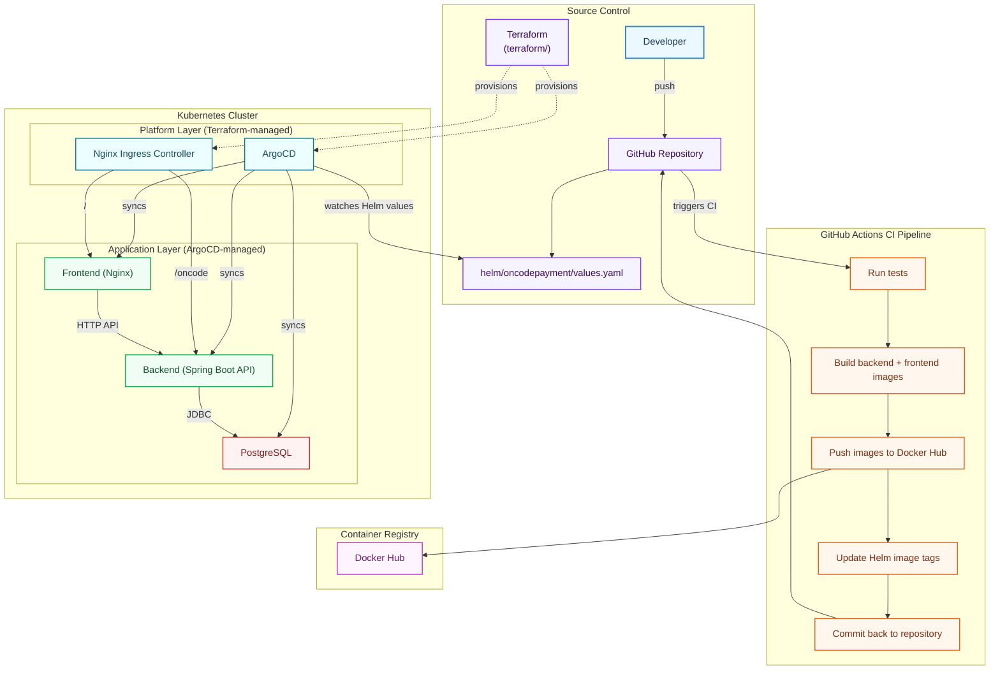

# OnCode Payment Recorder

This is a DevOps CRUD app for payment records. It includes a Spring Boot backend, Nginx frontend, PostgreSQL, Helm, Terraform, and ArgoCD.

## Architecture


```mermaid
flowchart TB
    classDef actor fill:#ebf8ff,stroke:#3182ce,color:#1a365d,stroke-width:2px;
    classDef repo fill:#f5f3ff,stroke:#7c3aed,color:#3b0764,stroke-width:1.5px;
    classDef ci fill:#fff7ed,stroke:#ea580c,color:#7c2d12,stroke-width:1.5px;
    classDef registry fill:#fdf4ff,stroke:#c026d3,color:#701a75,stroke-width:1.5px;
    classDef platform fill:#ecfeff,stroke:#0e7490,color:#164e63,stroke-width:1.5px;
    classDef app fill:#f0fdf4,stroke:#16a34a,color:#14532d,stroke-width:1.5px;
    classDef data fill:#fef2f2,stroke:#dc2626,color:#7f1d1d,stroke-width:1.5px;

    subgraph SOURCE["Source Control"]
        DEV["Developer"] -->|"push"| REPO["GitHub Repository"]
        REPO --> HELM["helm/oncodepayment/values.yaml"]
        TF["Terraform\n(terraform/)"]
    end

    subgraph CI["GitHub Actions CI Pipeline"]
        TEST["Run tests"] --> BUILD["Build backend + frontend images"]
        BUILD --> PUSH["Push images to Docker Hub"]
        PUSH --> UPDATE["Update Helm image tags"]
        UPDATE --> COMMIT["Commit back to repository"]
    end

    subgraph REG["Container Registry"]
        DH["Docker Hub"]
    end

    subgraph K8S["Kubernetes Cluster"]
        subgraph PLATFORM["Platform Layer (Terraform-managed)"]
            INGRESS["Nginx Ingress Controller"]
            ARGO["ArgoCD"]
        end
        subgraph APP["Application Layer (ArgoCD-managed)"]
            FE["Frontend (Nginx)"]
            BE["Backend (Spring Boot API)"]
            DB["PostgreSQL"]
        end
    end

    REPO -->|"triggers CI"| TEST
    PUSH --> DH
    COMMIT --> REPO

    ARGO -->|"watches Helm values"| HELM
    ARGO -->|"syncs"| FE
    ARGO -->|"syncs"| BE
    ARGO -->|"syncs"| DB

    TF -.->|"provisions"| INGRESS
    TF -.->|"provisions"| ARGO

    INGRESS -->|"/"| FE
    INGRESS -->|"/oncode"| BE
    FE -->|"HTTP API"| BE
    BE -->|"JDBC"| DB

    class DEV actor
    class REPO,HELM,TF repo
    class TEST,BUILD,PUSH,UPDATE,COMMIT ci
    class DH registry
    class INGRESS,ARGO platform
    class FE,BE app
    class DB data
```

## GitOps Flow

```
1. Developer pushes code to GitHub
2. GitHub Actions runs tests, builds Docker images, pushes to Docker Hub
3. CI updates image tags in helm/oncodepayment/values.yaml and commits
4. ArgoCD detects the change in the repo
5. ArgoCD renders the Helm chart and applies manifests to the cluster
6. New pods roll out with the updated images
```

## Stack

| Layer | Technology |
|-------|-----------|
| Backend | Spring Boot |
| Database | PostgreSQL (H2 fallback for local dev/tests) |
| Frontend | HTML, CSS, JavaScript, Nginx |
| Containers | Docker (multi-stage builds), Docker Compose |
| Orchestration | Kubernetes (Kind for local) |
| Infrastructure | Terraform |
| GitOps | ArgoCD |
| Ingress | Nginx Ingress Controller (host-based routing) |

## Run Locally with Docker

1. Create a local environment file:
```bash
cp .env.example .env
```

Edit `.env` and set a local database password. The `.env` file is ignored by Git and must not be committed.

2. Start the full stack:
```bash
docker compose up --build
```

3. Open:
- Frontend: http://localhost
- Backend API: http://localhost:8098/oncode/getpayments

4. Stop:
```bash
docker compose down
```

5. Stop and remove database volume:
```bash
docker compose down -v
```

## Run on Kubernetes (Kind + Terraform + ArgoCD)

### Prerequisites

- Docker
- [Kind](https://kind.sigs.k8s.io/)
- [Terraform](https://www.terraform.io/) >= 1.14
- kubectl
- Helm 3.x

### Setup

1. Create the Kind cluster:
```bash
kind create cluster --name oncodepayment --config kind-config.yaml
```

2. Deploy the platform with terraform:
```bash
cd terraform
terraform init
terraform apply
```
Terraform creates the following resources:
| Resource | Purpose |
|----------|---------|
| `kubernetes_namespace` | `oncodepayment`, `argocd`, `ingress-nginx` |
| `helm_release.nginx_ingress` | Nginx Ingress Controller for routing |
| `helm_release.argocd` | ArgoCD server, controller, repo-server |
| `kubectl_manifest.argocd_app` | ArgoCD Application pointing to `helm/oncodepayment` |

3. Access ArgoCD UI:
```bash
kubectl port-forward -n argocd svc/argocd-server 8080:443
```
- URL: https://localhost:8080
- Username: `admin`
- Password:
```bash
kubectl -n argocd get secret argocd-initial-admin-secret -o jsonpath='{.data.password}' | base64 -d
```

4. Access the app:
```bash
# Add to /etc/hosts (required, Ingress routes by hostname)
127.0.0.1 oncodepayment.local
```
Visit http://oncodepayment.local:8081

> **Why /etc/hosts?** The Ingress uses host-based routing (`oncodepayment.local`). Without this entry, the browser sends `Host: localhost` and the Ingress returns 404. The hosts entry makes the browser send the correct `Host` header.

### Tear Down

```bash
cd terraform
terraform destroy
kind delete cluster --name oncodepayment
```

## CI/CD Setup

1. Create a Docker Hub access token.
   Go to `https://hub.docker.com`, open **Account Settings**, open **Security**, then create a **New Access Token**.
   Set access permissions to **Read & Write**.

2. Add GitHub repository secrets.
   Open your repo, go to **Settings > Secrets and variables > Actions**, then add:
   - `DOCKERHUB_USERNAME` with your Docker Hub username
   - `DOCKERHUB_TOKEN` with your Docker Hub access token

3. Push to `master`.
   The pipeline runs tests, builds images, pushes to Docker Hub, and updates Helm tags.

4. Check ArgoCD dashboard to see the new version deployed.


## API Endpoints

Base path: `/oncode`

| Method | Path | Description |
|--------|------|-------------|
| GET | /getpayments | List all payments |
| GET | /getpayment/{id} | Get one payment |
| POST | /addpayment | Create a payment |
| PUT | /updatepayment/{id} | Update a payment |
| DELETE | /deletepayment/{id} | Delete a payment |

Sample payload:
```json
{
  "amount": 42.42,
  "fromAccount": 1111111,
  "toAccount": 2222222
}
```

## Project Structure

```
oncodepayment/
  Dockerfile                  # Multi-stage build (Maven build + JRE runtime)
  docker-compose.yml          # Local dev: backend + frontend + PostgreSQL
  kind-config.yaml            # Kind cluster config (control-plane)
  pom.xml                     # Spring Boot + PostgreSQL + H2
  src/                        # Java source code
  frontend/                   # Nginx frontend (Dockerfile + nginx.conf.template)
  helm/oncodepayment/         # Helm chart (10 templates)
    Chart.yaml
    values.yaml
    templates/
      backend-deployment.yml, backend-service.yml
      frontend-deployment.yml, frontend-service.yml
      postgresql-deployment.yml, postgresql-service.yml, postgresql-pvc.yml
      configmap.yml, secret.yml, ingress.yml
  terraform/                  # Platform infrastructure (Terraform)
    providers.tf              # Providers: helm, kubernetes, kubectl
    variables.tf              # kubeconfig_path, namespaces, repo URL, branch
    main.tf                   # Namespaces + Nginx Ingress
    argocd.tf                 # ArgoCD Helm release + Application manifest
    outputs.tf                # ArgoCD password retrieval command
  legacy/                     # Old CI/CD files (Jenkins, old K8s manifests)
```

## Configuration

Backend reads environment variables from `src/main/resources/application.properties`. Without env vars, it falls back to H2 in-memory for local dev.

| Variable | Purpose | Default |
|----------|---------|---------|
| DB_URL | JDBC connection string | jdbc:h2:mem:paymentdb |
| DB_USERNAME | Database username | sa |
| DB_PASSWORD | Database password | (empty) |
| DB_DRIVER | JDBC driver class | org.h2.Driver |
| JPA_DDL_AUTO | Hibernate DDL strategy | create-drop |
| JPA_DIALECT | Hibernate dialect | H2Dialect |
| CORS_ORIGINS | Allowed CORS origins | localhost variants |

## Security Note

This repository uses plaintext database credentials for local setup only.
You can change credentials in `helm/oncodepayment/values.yaml` and `docker-compose.yml`.
In production, use a secret manager pattern such as Sealed Secrets, SOPS, or External Secrets with Vault/AWS Secrets Manager.

Terraform variables (all have defaults, override with `-var` or `terraform.tfvars`):

| Variable | Default |
|----------|---------|
| kubeconfig_path | ~/.kube/config |
| argocd_namespace | argocd |
| app_namespace | oncodepayment |
| app_repo_url | https://github.com/DNinjaDev07/oncodepayment.git |
| app_target_revision | master |
